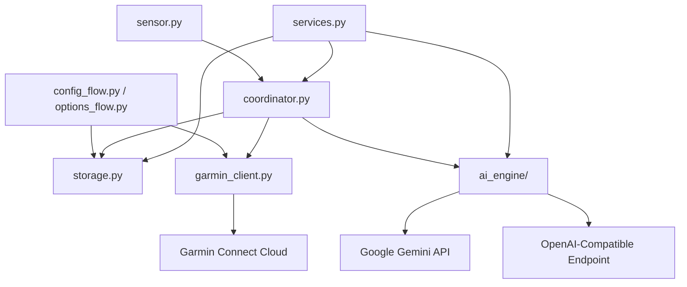

# Architecture Spine — garmin-ha-ai

## Design Paradigm

`garmin-ha-ai` follows a **Layered Adapter Architecture** built natively on Home Assistant's `DataUpdateCoordinator` pattern with a pluggable **Strategy Pattern** for AI providers.

```text
+-----------------------------------------------------------------------+
|                 Home Assistant UI / Entities / Services               |
|      (sensor.py, services.py, config_flow.py, options_flow.py)       |
+------------------------------------+----------------------------------+
                                     |
                                     v
+-----------------------------------------------------------------------+
|                    GarminDataUpdateCoordinator                        |
|        (Schedules background fetching, triggers AI analysis)          |
+-------------------+--------------------------------+------------------+
                    |                                |
                    v                                v
+-----------------------+               +-------------------------------+
|   garmin_client.py    |               |          ai_engine/           |
| (python-garminconnect)|               | (Gemini & OpenAI Providers)   |
+-----------+-----------+               +---------------+---------------+
            |                                           |
            v                                           v
+-----------------------+               +-------------------------------+
|  Garmin Connect Cloud |               |  LLM APIs (Gemini / OpenAI)   |
+-----------------------+               +-------------------------------+
                                |
                                v
+-----------------------------------------------------------------------+
|                         storage.py (HA Store)                         |
|   (.storage/garmin_ha_ai_tokens.json & garmin_ha_ai_history.json)      |
+-----------------------------------------------------------------------+
```

### Module Responsibilities
- **`custom_components/garmin_ha_ai/__init__.py`**: Component entry point managing setup, unload, service registration, and entry updates.
- **`config_flow.py` & `options_flow.py`**: UI forms for initial credential setup, MFA callback handling, provider selection, and runtime options (goals, schedule, retention window).
- **`coordinator.py`**: `GarminDataUpdateCoordinator` orchestrating periodic data ingestion and scheduled daily report generation.
- **`garmin_client.py`**: Authentication adapter around `python-garminconnect`, token refresh, MFA PIN resolution, and raw payload normalization into `GarminDailyMetrics`.
- **`storage.py`**: Encapsulates Home Assistant `Store` helper for persisting OAuth tokens (`garmin_ha_ai_tokens`) and local N-day metric snapshots (`garmin_ha_ai_history`).
- **`ai_engine/`**: Pluggable AI engine package containing `base.py` (`BaseAIProvider`), `gemini.py` (`GeminiProvider`), `openai.py` (`OpenAIProvider`), and `prompt.py` (context prompt assembly).
- **`sensor.py`**: Home Assistant sensor entity implementations for Garmin metrics and AI report states.
- **`services.py`**: Home Assistant service definitions for `garmin_ha_ai.ask_question` and `garmin_ha_ai.generate_report`.
- **`const.py`**: Constants, domain identifiers, default values, and config keys.

---

## Invariants & Rules

## Invariants & Rules

### AD-1 — Layered Adapter with DataUpdateCoordinator Strategy Pattern
- **Binds:** `all`
- **Prevents:** Monolithic tightly-coupled entity code, un-testable business logic, and tangled LLM client calls.
- **Rule:** Component MUST isolate responsibilities across `garmin_client.py` (ingestion), `ai_engine/` (AI analysis), `storage.py` (local persistence), `coordinator.py` (orchestration), and HA platform modules (`sensor.py`, `services.py`). No direct API calls may be made inside entity classes.

### AD-2 — Local JSON Snapshot Store with Configurable Retention & Asyncio Lock
- **Binds:** `storage.py`, `services.py`, `options_flow.py`
- **Prevents:** Rate-limiting by Garmin API during interactive Q&A service calls, store JSON write corruption during concurrent calls, and crashes on missing store files.
- **Rule:** Daily metrics MUST be saved locally to HA `.storage/garmin_ha_ai_history.json`. All disk read/write operations MUST be guarded by an `asyncio.Lock()`. Missing history store files on clean install MUST be handled gracefully by returning an empty store dictionary. Retention defaults to 30 days and MUST be configurable by the user via Options Flow (`retention_days`). Interactive Q&A MUST query this local store for historical context rather than hitting Garmin cloud APIs.

### AD-3 — Dual Native Driver AI Engine Architecture
- **Binds:** `ai_engine/`
- **Prevents:** Bloating custom component dependencies with heavy frameworks like LangChain or LlamaIndex and hanging HTTP calls on slow local models.
- **Rule:** AI provider drivers MUST be lightweight and native. Google Gemini integration MUST use the official `google-genai` SDK. OpenAI-compatible integration MUST use `httpx` async client targeting standard `/v1/chat/completions` endpoints with configurable request timeouts (default 30 seconds). Prompt assembly in `prompt.py` MUST estimate and truncate prompt context to fit model context limits.

### AD-4 — OAuth Token Persistence & MFA Authentication Flow
- **Binds:** `config_flow.py`, `garmin_client.py`, `storage.py`
- **Prevents:** Storing plaintext user passwords in config files, losing login sessions across Home Assistant restarts, and hanging MFA login steps.
- **Rule:** Credentials MUST be authenticated via `python-garminconnect`. If an MFA challenge is returned, `config_flow` MUST transition to step `step_mfa` (with resend/retry recovery on timeout). On auth success, DI OAuth tokens MUST be saved to HA `.storage/garmin_ha_ai_tokens.json`. Expired access tokens MUST be refreshed silently using refresh tokens. If tokens are invalidated or revoked, the coordinator MUST trigger `async_step_reauth` / raise `ConfigEntryAuthFailed` to prompt native HA UI re-authentication.

### AD-5 — Entity State Protection & Extra State Attributes for Reports
- **Binds:** `sensor.py`, `coordinator.py`
- **Prevents:** Home Assistant core error `InvalidStateError` caused by state string lengths exceeding HA's 255-character hard limit.
- **Rule:** `sensor.garmin_ai_health_report_short` state MUST be strictly truncated in Python (`short_summary[:250] + "..."` when needed) to stay under 255 characters. `sensor.garmin_ai_health_report_long` state MUST contain a short summary header/timestamp, while the full rich Markdown report MUST be stored in `extra_state_attributes["full_report"]`.

### AD-6 — Modern HA Service Response Support & History Clamping (`SupportsResponse.OPTIONAL`)
- **Binds:** `services.py`, `ai_engine/`
- **Prevents:** Clunky asynchronous event dispatching for interactive Q&A service callers and out-of-bounds history array indexing.
- **Rule:** Service `garmin_ha_ai.ask_question` MUST register using `supports_response=SupportsResponse.OPTIONAL`. When invoked, it MUST accept `question`, `days_history` (clamped to `min(requested_days, available_stored_days)`), and an optional `response_entity`. It MUST return a dictionary `{"answer": "...", "question": "...", "context_days": N}` directly to the caller, while updating `sensor.garmin_ai_last_answer` or the target `response_entity`.

### AD-7 — Debounced Report Generation & Fault-Tolerant Notification Dispatch
- **Binds:** `coordinator.py`, `services.py`
- **Prevents:** Redundant LLM API quota consumption from rapid manual triggers and sync pipeline crashes when notification entities are renamed or missing.
- **Rule:** Report generation in `coordinator.py` MUST maintain an `_is_generating` boolean lock to discard rapid duplicate calls. Notification dispatch to configured targets MUST catch `ServiceNotFound` and `HomeAssistantError`, logging a warning while allowing entity state updates to complete cleanly.

### Dependency Topology Rule



---

## Consistency Conventions

| Concern | Convention |
| --- | --- |
| Naming | Domain `garmin_ha_ai`, snake_case Python modules, lower_snake_case HA entity IDs (`sensor.garmin_steps`, `sensor.garmin_ai_health_report_short`). |
| Data & Formats | Dates in ISO 8601 (`YYYY-MM-DD`). Target dates aligned to `hass.config.time_zone`. Metric units standard SI (`steps`, `bpm`, `kg`, `km`, `%`). |
| State & Mutation | State updates handled strictly via `GarminDataUpdateCoordinator`. Service calls trigger async AI tasks. |
| Error Handling | Ingestion errors raise `UpdateFailed`. Auth failure raises `ConfigEntryAuthFailed`. LLM timeouts retry up to 2 times with exponential backoff. |

---

## Stack

| Name | Version | Role |
| --- | --- | --- |
| Python | `>= 3.12` | Runtime Language |
| Home Assistant Core | `>= 2024.1.0` | Target Host Platform |
| `garminconnect` | `>= 0.3.10` | Garmin Connect API Client |
| `google-genai` | `>= 1.0.0` | Google Gemini SDK Driver |
| `httpx` | `>= 0.27.0` | OpenAI Async HTTP Client Driver |
| `voluptuous` | Native HA | Data Validation Schema Engine |

---

## Structural Seed

### Source Directory Scaffolding

```text
custom_components/garmin_ha_ai/
  __init__.py           # Component setup, unload, entry listener & service registration
  manifest.json         # HA component manifest & PyPI dependencies
  config_flow.py        # UI setup wizard & MFA callback flow
  options_flow.py       # UI options flow for runtime settings & retention window
  const.py              # Global domain constants, defaults & schema keys
  coordinator.py        # GarminDataUpdateCoordinator implementation
  garmin_client.py      # python-garminconnect auth & data fetch adapter
  storage.py            # HA .storage helper wrapper for tokens & history JSON
  sensor.py             # Sensor platform entities (metrics & AI reports)
  services.py           # HA service handlers (ask_question, generate_report)
  ai_engine/
    __init__.py         # AI Engine factory initializer
    base.py             # BaseAIProvider abstract protocol interface
    gemini.py           # GeminiProvider driver (google-genai)
    openai.py           # OpenAIProvider driver (httpx async)
    prompt.py           # Prompt assembler & context formatter
```

### Core Data Models

```python
@dataclass
class GarminDailyMetrics:
    date: str  # YYYY-MM-DD
    steps: int | None = None
    distance_meters: float | None = None
    calories: int | None = None
    resting_hr: int | None = None
    avg_stress: int | None = None
    sleep_score: int | None = None
    body_battery_min: int | None = None
    body_battery_max: int | None = None
    hrv_status: str | None = None
    weight_kg: float | None = None
    activities: list[dict] = field(default_factory=list)

@dataclass
class AIHealthReport:
    timestamp: str  # ISO 8601
    short_summary: str
    full_report: str
    provider_used: str
    model_used: str
```

---

## Capability → Architecture Map

| Capability / Area | Lives in | Governed by |
| --- | --- | --- |
| Credential & MFA Auth (FR-1, FR-16) | `config_flow.py`, `garmin_client.py` | AD-4 |
| Metric Extraction (FR-2) | `garmin_client.py` | AD-1 |
| Scheduled Polling & Options (FR-3, FR-17) | `coordinator.py`, `options_flow.py` | AD-1, AD-2 |
| Offline Resilience (FR-4) | `coordinator.py`, `storage.py` | AD-2 |
| Gemini AI Provider (FR-5) | `ai_engine/gemini.py` | AD-3 |
| Generic OpenAI Provider (FR-6) | `ai_engine/openai.py` | AD-3 |
| Prompt Assembly (FR-7) | `ai_engine/prompt.py` | AD-1, AD-2 |
| Metric & AI Report Entities (FR-9, FR-10, FR-11) | `sensor.py` | AD-5 |
| Multi-Channel Delivery (FR-12) | `coordinator.py` | AD-5 |
| Interactive Q&A Service (FR-14, FR-15) | `services.py`, `storage.py` | AD-2, AD-6 |
| Custom Component Packaging (FR-18) | `manifest.json` | AD-1, Stack |

---

## Deferred

| Item | Deferred Reason | Revisit Condition |
| --- | --- | --- |
| Direct Bluetooth Hardware Pairing | Ingestion relies on Garmin Cloud API via `python-garminconnect`. Direct BT pairing is complex and unnecessary for daily health summaries. | User explicitly requests local offline BLE watch syncing in v2. |
| Multi-Account Profile Switching | Single Garmin user profile per integration entry in v1 simplifies token storage and entity naming. | User requests multiple Garmin accounts on a single Home Assistant instance. |
